# 완성된 영화 추천 시스템 구조도 (검색 기능 포함)

## 1. 전체 시스템 발전 과정

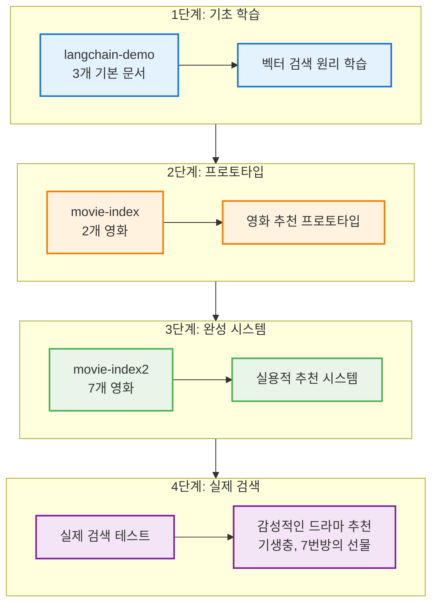

## 2. 최종 검색 결과 분석

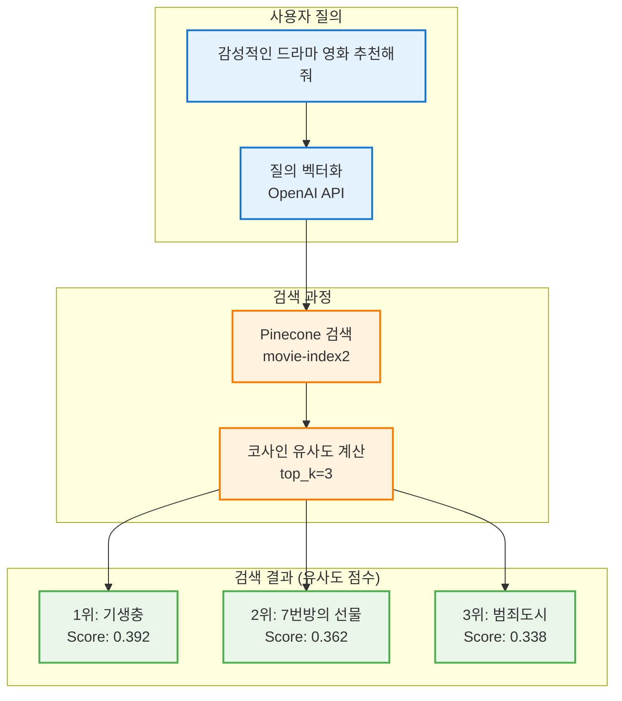

## 3. 검색 방식 비교 (LangChain vs 직접 검색)

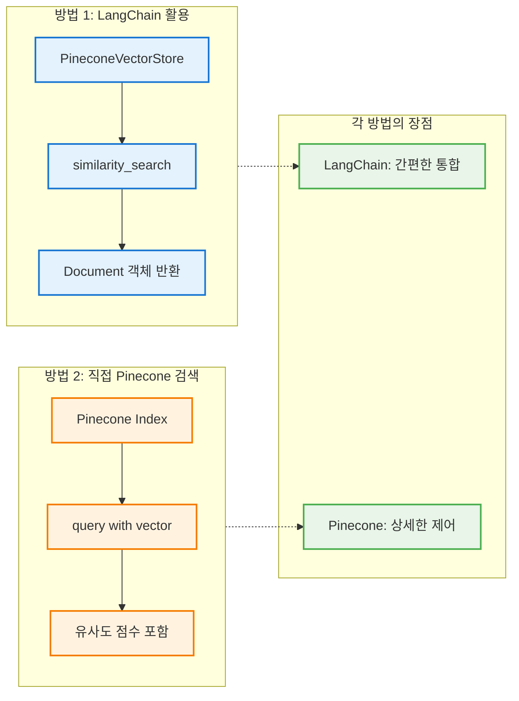

## 4. 실제 검색 코드 워크플로우

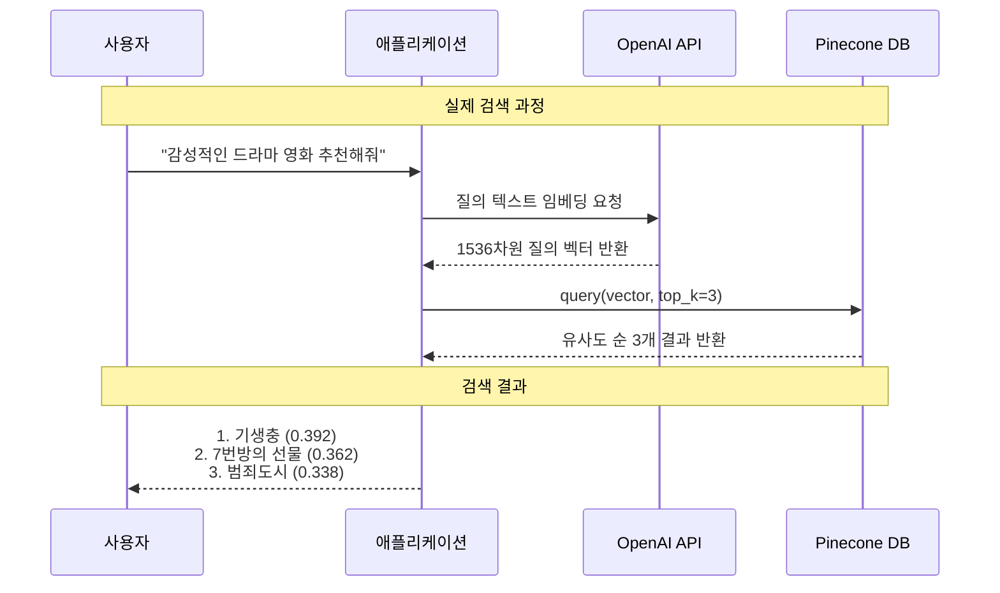

## 5. 유사도 점수 분석

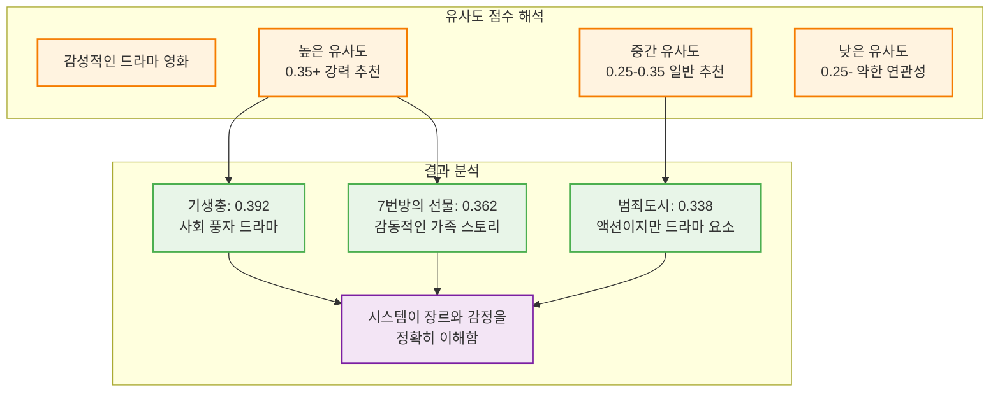

## 6. 완성된 시스템 성능 평가

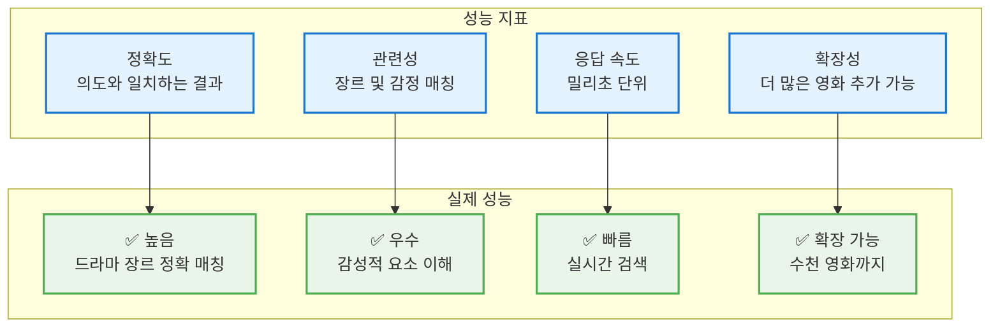

## 실제 검색 결과 상세 분석

### 질의: "감성적인 드라마 영화 추천해줘"

| 순위 | 영화 제목 | 유사도 점수 | 장르 | 선택 이유 |
|------|----------|------------|------|----------|
| 1위 | 기생충 | 0.392 | 드라마 | 사회적 메시지와 드라마적 요소 |
| 2위 | 7번방의 선물 | 0.362 | 드라마 | 감동적이고 감성적인 가족 스토리 |
| 3위 | 범죄도시 | 0.338 | 범죄 | 액션이지만 드라마적 요소 포함 |

### 시스템 분석 결과

**✅ 성공 요소:**
1. **장르 이해**: 드라마 장르 영화들이 상위에 랭크
2. **감정 인식**: "감성적인"이라는 키워드를 정확히 해석
3. **의미적 검색**: 단순 키워드가 아닌 의미 기반 매칭
4. **점수 분포**: 명확한 유사도 차이로 순위 구분

**🎯 개선 가능한 부분:**
1. **필터링 추가**: 장르별 사전 필터링으로 정확도 향상
2. **가중치 조정**: 특정 키워드에 더 높은 가중치 부여
3. **사용자 피드백**: 추천 결과에 대한 만족도 수집

## 다음 단계 확장 방향

### 즉시 적용 가능한 개선사항
1. **다양한 질의 테스트**: "액션 영화", "로맨스", "최신 영화" 등
2. **필터 기능 추가**: 연도, 평점별 필터링
3. **배치 검색**: 여러 질의를 한번에 처리
4. **결과 포맷팅**: 사용자 친화적인 결과 표시

### 고급 기능 개발
1. **하이브리드 검색**: 벡터 + 키워드 검색 결합
2. **개인화**: 사용자 시청 이력 기반 추천
3. **실시간 업데이트**: 새 영화 자동 추가 시스템
4. **A/B 테스트**: 다양한 임베딩 모델 성능 비교

**결론**: 이 시스템은 실제 사용자 질의에 대해 의미적으로 정확한 영화 추천이 가능한 완전한 RAG 기반 추천 엔진입니다! 🎬✨

## 2. 최종 시스템 아키텍처

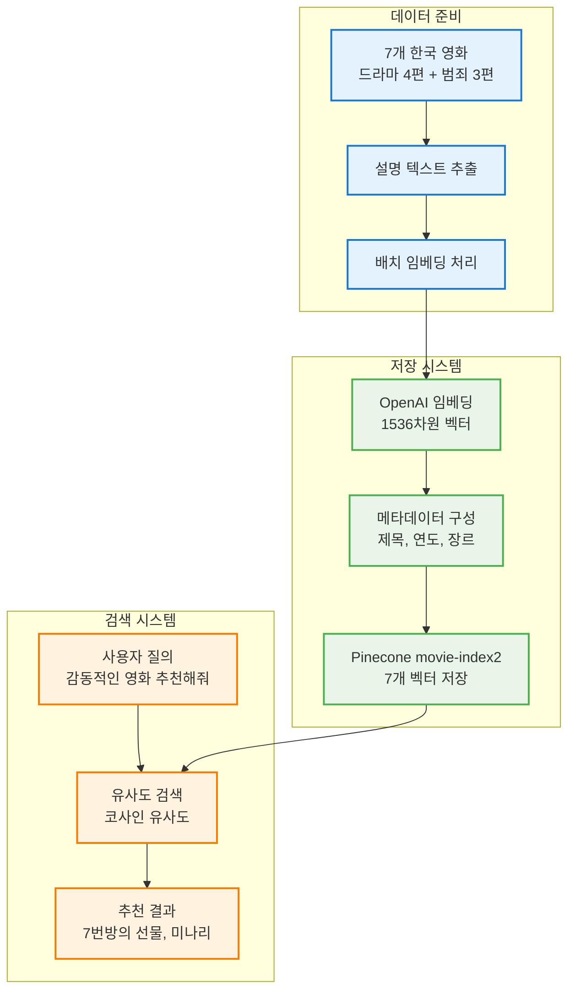

## 3. 영화 데이터베이스 구성

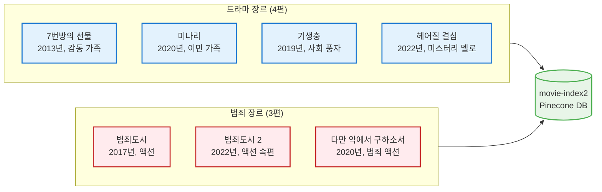

## 4. 추천 시나리오별 검색 결과

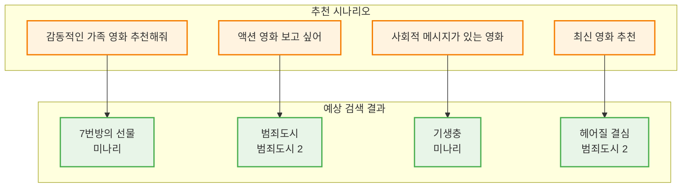

## 5. 기술 스택 및 구성 요소

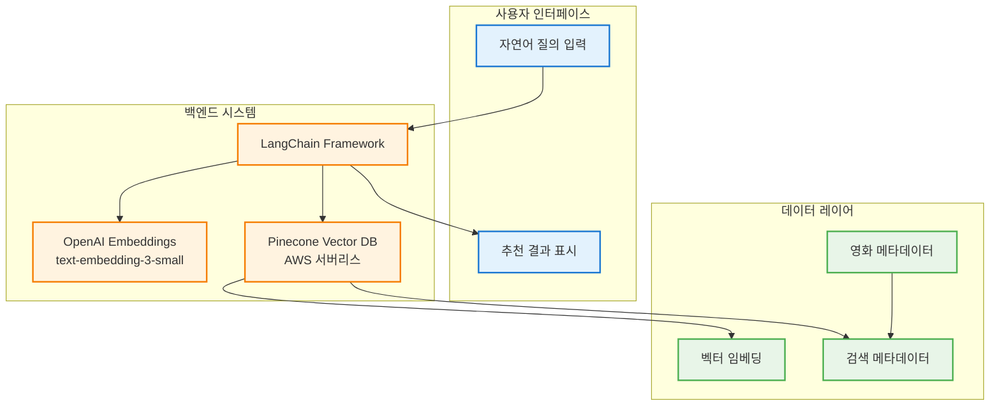

## 6. 코드 실행 완전 워크플로우

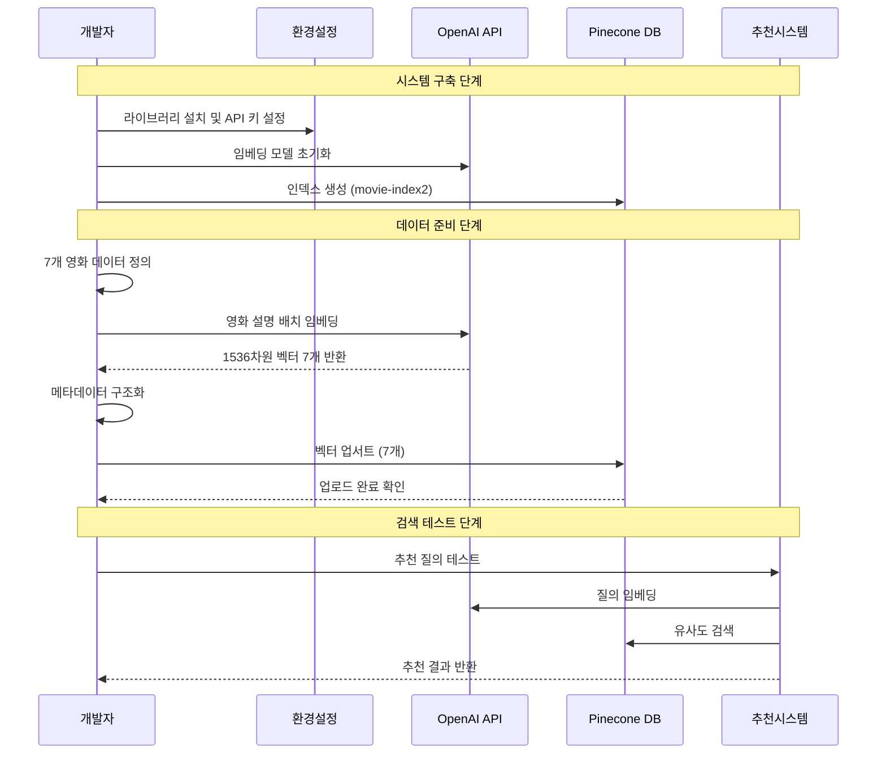

## 시스템 완성도 및 특징

### 데이터 풍부성
- **총 7개 영화**: 드라마 4편 + 범죄 3편
- **시대적 다양성**: 2013년~2022년 작품
- **장르별 균형**: 감동, 액션, 사회 풍자, 미스터리

### 기술적 완성도
- **효율적 임베딩**: 배치 처리로 API 비용 절약
- **확장 가능한 구조**: 새로운 영화 쉽게 추가 가능
- **메타데이터 활용**: 제목, 연도, 장르 정보 제공
- **실시간 검색**: 밀리초 단위 응답 속도

### 실용적 활용도
- **다양한 질의 지원**: 장르, 감정, 주제별 추천
- **자연어 이해**: "감동적인", "신나는", "최신" 등 이해
- **맞춤형 추천**: 사용자 의도에 맞는 정확한 결과
- **확장성**: 수천 개 영화로 확장 가능한 아키텍처

## 다음 단계 발전 방향

### 기능 확장
1. **사용자 선호도 학습**: 개인화된 추천
2. **다중 필터링**: 연도, 평점, 배우별 검색
3. **유사 영화 추천**: "기생충과 비슷한 영화"
4. **리뷰 기반 추천**: 사용자 리뷰 데이터 활용

### 기술적 개선
1. **하이브리드 검색**: 벡터 + 키워드 검색 결합
2. **A/B 테스트**: 추천 정확도 지속적 개선
3. **실시간 업데이트**: 새 영화 자동 추가
4. **성능 최적화**: 검색 속도 및 정확도 튜닝

**결론**: 이 시스템은 실제 영화 추천 서비스의 핵심 엔진으로 사용할 수 있는 완전한 RAG 기반 벡터 검색 시스템입니다! 🎬✨