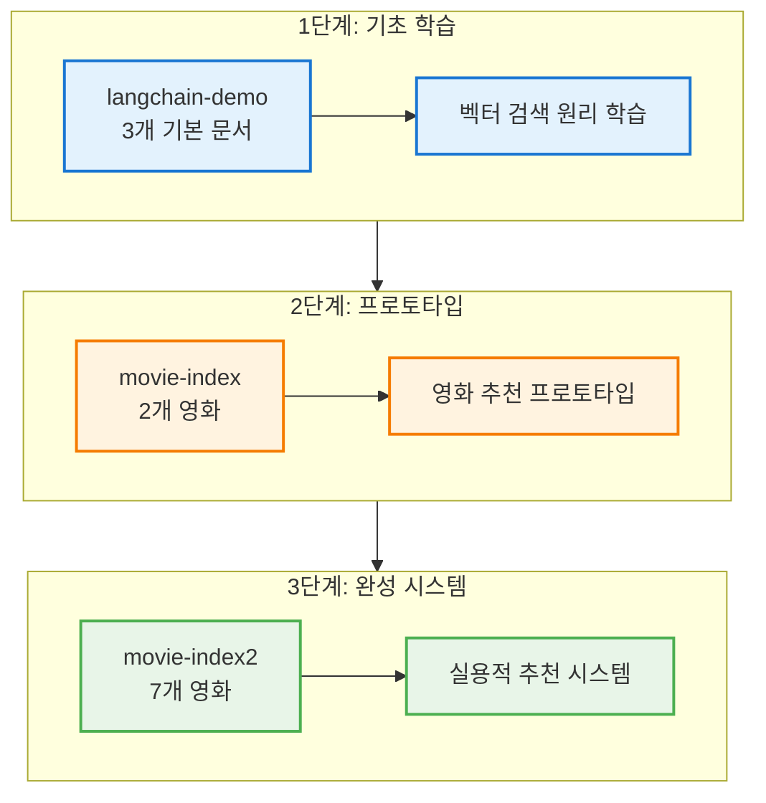
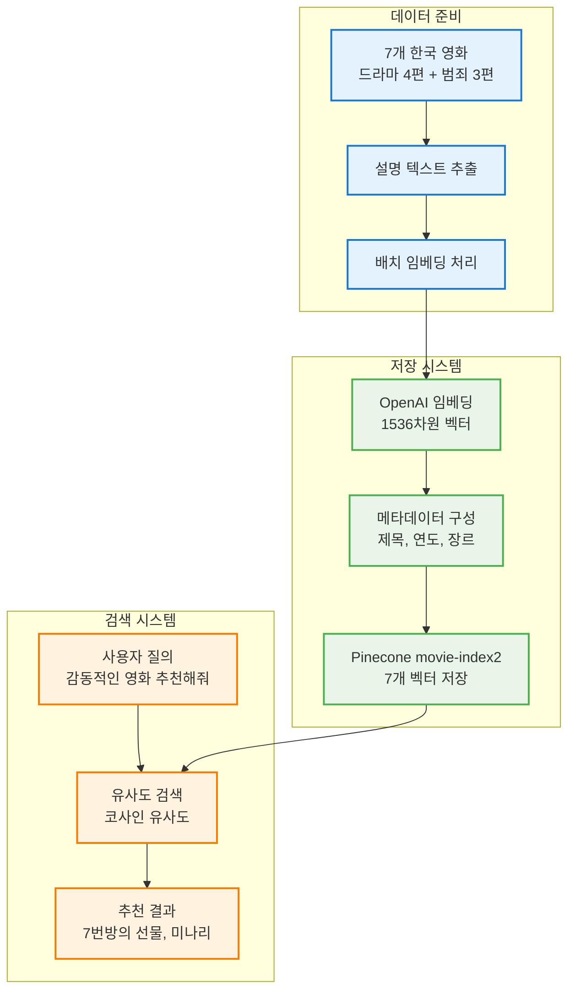
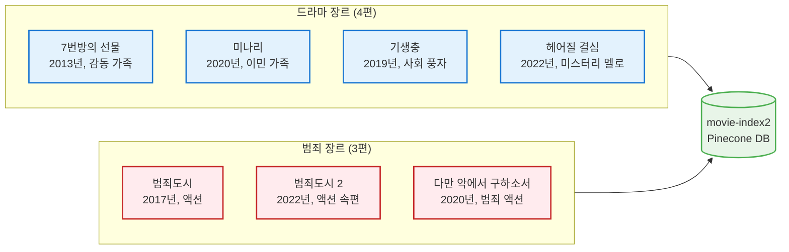
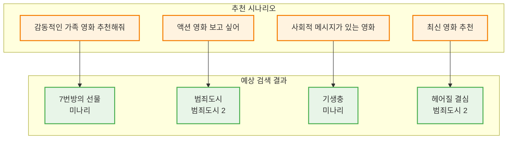
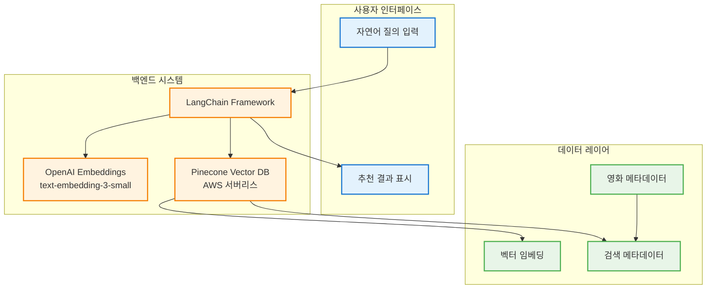
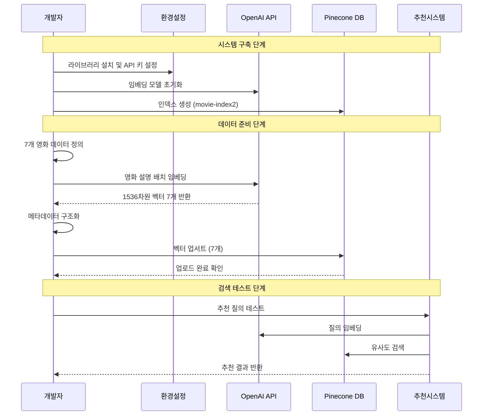

# 완성된 영화 추천 시스템 구조도

## 1. 전체 시스템 발전 과정

## 2. 최종 시스템 아키텍처

## 3. 영화 데이터베이스 구성

## 4. 추천 시나리오별 검색 결과

## 5. 기술 스택 및 구성 요소

## 6. 코드 실행 완전 워크플로우

## 시스템 완성도 및 특징

### 데이터 풍부성
- **총 7개 영화**: 드라마 4편 + 범죄 3편
- **시대적 다양성**: 2013년~2022년 작품
- **장르별 균형**: 감동, 액션, 사회 풍자, 미스터리

### 기술적 완성도
- **효율적 임베딩**: 배치 처리로 API 비용 절약
- **확장 가능한 구조**: 새로운 영화 쉽게 추가 가능
- **메타데이터 활용**: 제목, 연도, 장르 정보 제공
- **실시간 검색**: 밀리초 단위 응답 속도

### 실용적 활용도
- **다양한 질의 지원**: 장르, 감정, 주제별 추천
- **자연어 이해**: "감동적인", "신나는", "최신" 등 이해
- **맞춤형 추천**: 사용자 의도에 맞는 정확한 결과
- **확장성**: 수천 개 영화로 확장 가능한 아키텍처

## 다음 단계 발전 방향

### 기능 확장
1. **사용자 선호도 학습**: 개인화된 추천
2. **다중 필터링**: 연도, 평점, 배우별 검색
3. **유사 영화 추천**: "기생충과 비슷한 영화"
4. **리뷰 기반 추천**: 사용자 리뷰 데이터 활용

### 기술적 개선
1. **하이브리드 검색**: 벡터 + 키워드 검색 결합
2. **A/B 테스트**: 추천 정확도 지속적 개선
3. **실시간 업데이트**: 새 영화 자동 추가
4. **성능 최적화**: 검색 속도 및 정확도 튜닝

**결론**: 이 시스템은 실제 영화 추천 서비스의 핵심 엔진으로 사용할 수 있는 완전한 RAG 기반 벡터 검색 시스템입니다! 🎬✨