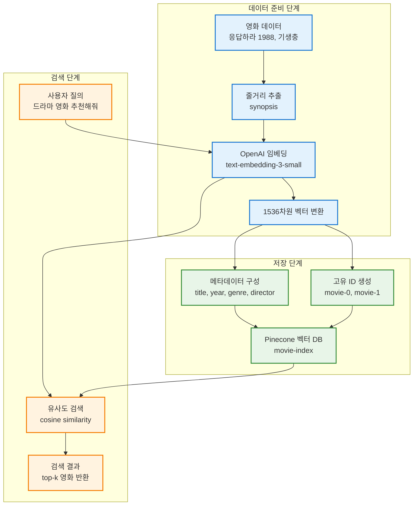
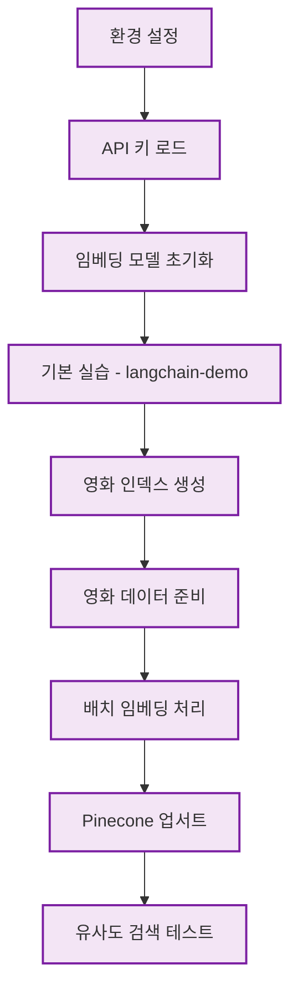
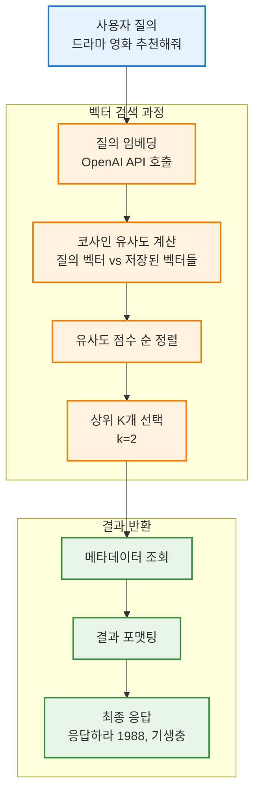
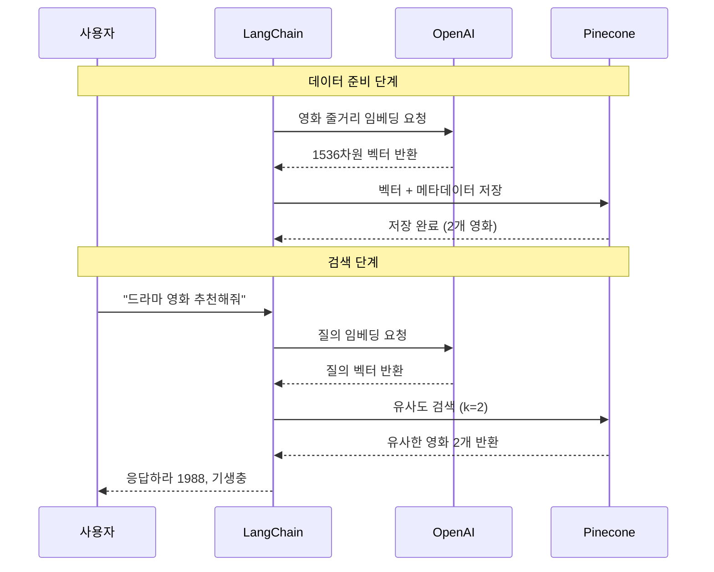

# Pinecone 영화 추천 시스템 구조도

## 1. 전체 시스템 아키텍처



## 2. 코드 실행 워크플로우



## 3. 데이터 변환 과정

```mermaid
graph LR
    subgraph "원본 데이터"
        MOVIE1[응답하라 1988<br/>줄거리: 1988년 서울 쌍문동...]
        MOVIE2[기생충<br/>줄거리: 가난한 가족과 부유한 가족...]
    end
    
    subgraph "임베딩 변환"
        EMB1[Vector 1536차원<br/>[0.1, -0.3, 0.8, ...]]
        EMB2[Vector 1536차원<br/>[0.2, 0.5, -0.1, ...]]
    end
    
    subgraph "Pinecone 저장"
        STORE1[movie-0<br/>vector + metadata]
        STORE2[movie-1<br/>vector + metadata]
    end
    
    MOVIE1 --> EMB1
    MOVIE2 --> EMB2
    EMB1 --> STORE1
    EMB2 --> STORE2
    
    classDef movieStyle fill:#e3f2fd,stroke:#1976d2,stroke-width:2px
    classDef embStyle fill:#fff3e0,stroke:#f57c00,stroke-width:2px
    classDef storeStyle fill:#e8f5e8,stroke:#388e3c,stroke-width:2px
    
    class MOVIE1,MOVIE2 movieStyle
    class EMB1,EMB2 embStyle
    class STORE1,STORE2 storeStyle
```

## 4. 검색 메커니즘



## 5. 시스템 구성 요소 상세

```mermaid
graph TD
    subgraph "OpenAI 임베딩"
        OPENAI[OpenAI API<br/>text-embedding-3-small]
        DIM[1536 차원 벡터]
        COST[비용 효율적<br/>5배 저렴]
        
        OPENAI --> DIM
        OPENAI --> COST
    end
    
    subgraph "Pinecone 설정"
        INDEX[movie-index]
        METRIC[cosine 유사도]
        CLOUD[AWS us-east-1<br/>서버리스]
        CAPACITY[무제한 확장]
        
        INDEX --> METRIC
        INDEX --> CLOUD
        INDEX --> CAPACITY
    end
    
    subgraph "LangChain 통합"
        VECTORSTORE[PineconeVectorStore]
        SEARCH_API[similarity_search()]
        BATCH[배치 처리 최적화]
        
        VECTORSTORE --> SEARCH_API
        VECTORSTORE --> BATCH
    end
    
    classDef openaiStyle fill:#e3f2fd,stroke:#1976d2,stroke-width:2px
    classDef pineconeStyle fill:#e8f5e8,stroke:#388e3c,stroke-width:2px
    classDef langchainStyle fill:#fff3e0,stroke:#f57c00,stroke-width:2px
    
    class OPENAI,DIM,COST openaiStyle
    class INDEX,METRIC,CLOUD,CAPACITY pineconeStyle
    class VECTORSTORE,SEARCH_API,BATCH langchainStyle
```

## 6. 실제 데이터 흐름 예시



## 코드 단계별 상세 설명

### 단계 1: 환경 설정
```python
# 라이브러리 설치 및 API 키 로드
%pip install python-dotenv langchain langchain-openai langchain-pinecone
load_dotenv()
```
- **목적**: 필요한 도구들을 설치하고 보안 설정
- **중요**: API 키를 환경변수로 안전하게 관리

### 단계 2: 임베딩 모델 준비
```python
embedding = OpenAIEmbeddings(model="text-embedding-3-small")
```
- **선택 이유**: 성능과 비용의 최적 균형점
- **출력**: 1536차원 의미 벡터

### 단계 3: 벡터 인덱스 구축
```python
pc.create_index(name="movie-index", dimension=1536, metric="cosine")
```
- **설정**: 코사인 유사도로 의미적 유사성 측정
- **인프라**: AWS 서버리스로 자동 확장

### 단계 4: 대량 데이터 처리
```python
vectors = embeddings.embed_documents(texts)  # 배치 처리
movie_index.upsert(vectors=zip(ids, vectors, metas))
```
- **최적화**: 개별 처리 대신 배치로 효율성 향상
- **결과**: 2개 영화 벡터 저장 완료

### 단계 5: 실시간 검색
```python
results = vector_store.similarity_search("드라마 영화 추천해줘", k=2)
```
- **검색 방식**: 의미 기반 유사도 매칭
- **응답 속도**: 밀리초 단위 실시간 검색

## 시스템의 장점

1. **확장성**: Pinecone의 서버리스 아키텍처로 무제한 확장
2. **정확성**: OpenAI 임베딩으로 높은 의미 이해
3. **효율성**: 배치 처리와 벡터 검색으로 빠른 응답
4. **유연성**: LangChain 통합으로 쉬운 개발과 유지보수

**결론**: 이 시스템은 실제 영화 추천 서비스의 핵심 엔진으로 활용할 수 있는 완전한 벡터 검색 파이프라인입니다!