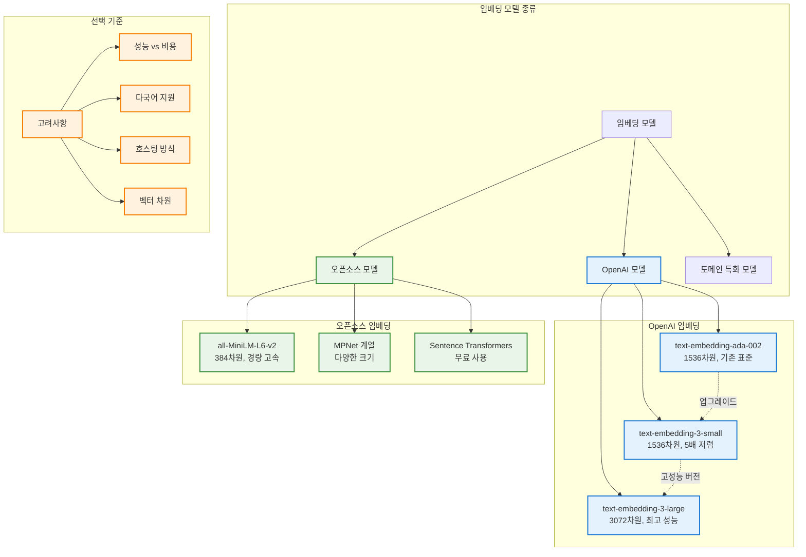

# RAG 시스템 종합 구조도

## 1. RAG 개요 및 필요성


## 2. RAG 시스템 전체 아키텍처


## 3. 벡터 데이터베이스 비교


## 4. 임베딩 모델 비교



## 5. Pinecone 실습 워크플로우

```mermaid
graph TD
    subgraph "환경 설정"
        INSTALL[패키지 설치<br/>pip install openai pinecone-client langchain]
        ENV[API 키 설정<br/>.env 파일 구성]
        INSTALL --> ENV
    end
    
    subgraph "Pinecone 초기화"
        CONNECT[Pinecone 클라이언트 연결]
        INDEX[인덱스 생성<br/>1536차원 설정]
        EMBED_MODEL[OpenAI 임베딩 모델<br/>text-embedding-3-small]
        
        ENV --> CONNECT
        CONNECT --> INDEX
        INDEX --> EMBED_MODEL
    end
    
    subgraph "문서 처리"
        CREATE_DOCS[예시 문서 생성<br/>content + metadata]
        VECTOR_STORE[PineconeVectorStore 초기화]
        ADD_DOCS[문서 임베딩 및 저장<br/>add_documents()]
        
        EMBED_MODEL --> CREATE_DOCS
        CREATE_DOCS --> VECTOR_STORE
        VECTOR_STORE --> ADD_DOCS
    end
    
    subgraph "검색 실행"
        QUERY1[질의 1: LangChain 관련<br/>필터: source=tweet]
        QUERY2[질의 2: 날씨 관련<br/>필터: source=news]
        RESULTS[검색 결과 + 유사도 점수]
        
        ADD_DOCS --> QUERY1
        ADD_DOCS --> QUERY2
        QUERY1 --> RESULTS
        QUERY2 --> RESULTS
    end
    
    classDef setupClass fill:#e8f5e8,stroke:#4caf50,stroke-width:2px
    classDef processClass fill:#e3f2fd,stroke:#2196f3,stroke-width:2px
    classDef searchClass fill:#fff3e0,stroke:#ff9800,stroke-width:2px
    
    class INSTALL,ENV,CONNECT,INDEX,EMBED_MODEL setupClass
    class CREATE_DOCS,VECTOR_STORE,ADD_DOCS processClass
    class QUERY1,QUERY2,RESULTS searchClass
```

## 6. RAG 시스템 핵심 개념 요약


이렇게 첨부파일의 RAG 내용을 6개의 다이어그램으로 구조화했어요:

1. **RAG 개요**: LLM 한계와 RAG 솔루션
2. **전체 아키텍처**: 데이터 준비부터 답변 생성까지
3. **벡터 DB 비교**: Pinecone, Qdrant, Weaviate, FAISS 특징
4. **임베딩 모델**: OpenAI vs 오픈소스, 선택 기준
5. **실습 워크플로우**: Pinecone 구현 단계
6. **핵심 개념 요약**: 마인드맵으로 전체 정리

각 다이어그램이 문서의 핵심 내용을 시각적으로 이해하기 쉽게 정리했어요!