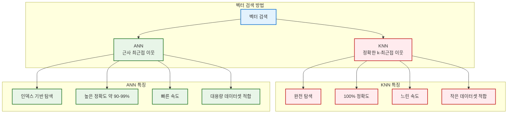
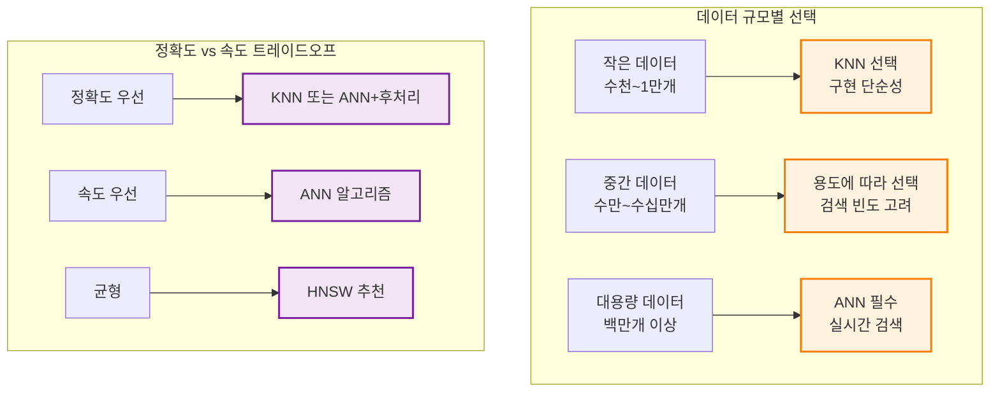
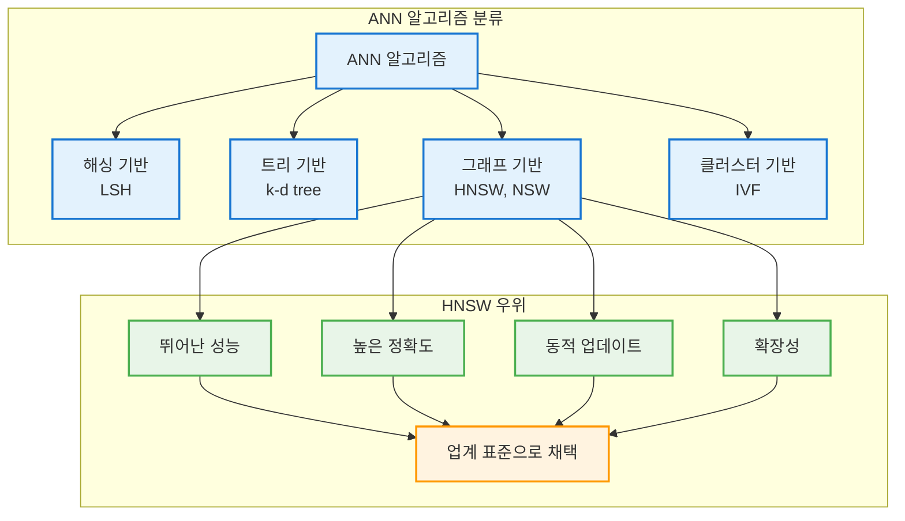
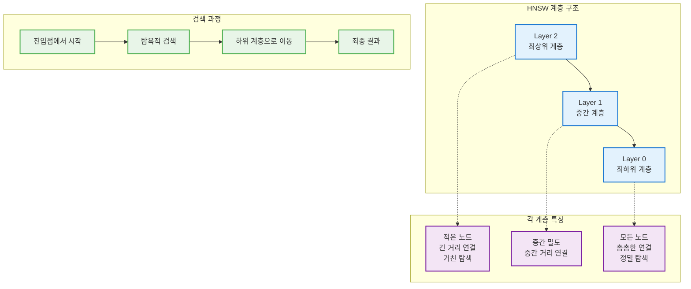
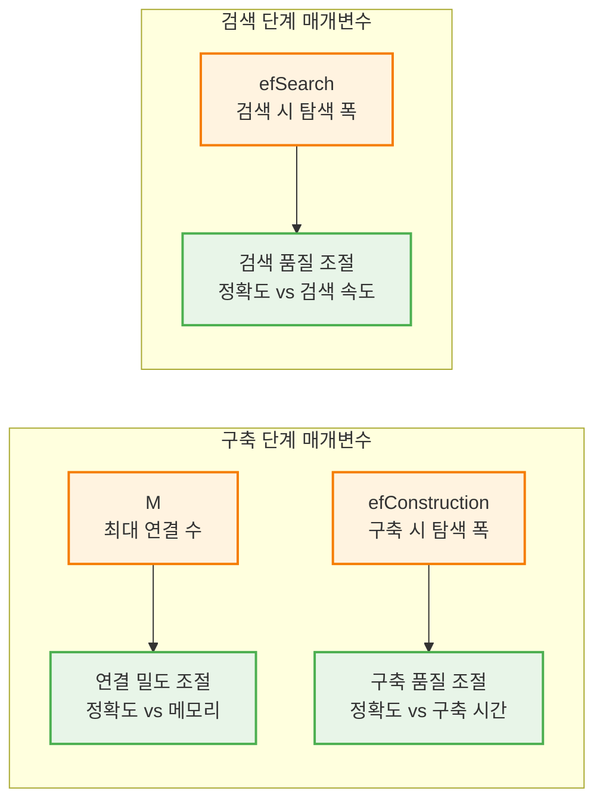
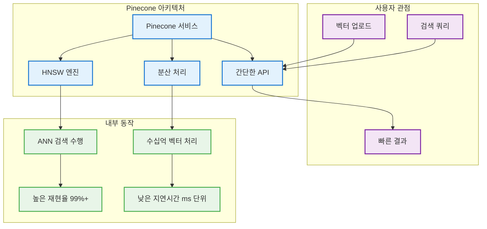
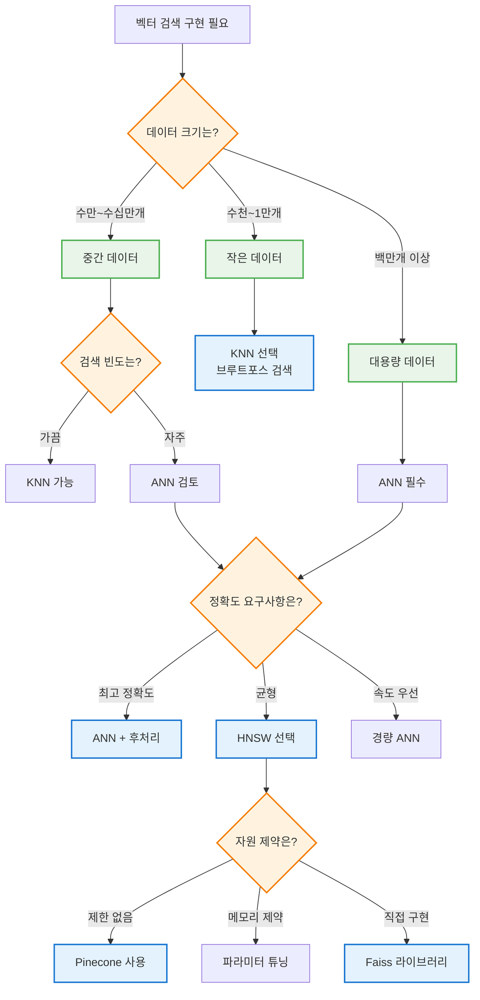

# 벡터 검색 이론 종합 구조도 (KNN, ANN, HNSW)

## 1. 벡터 검색 개요 및 비교



## 2. KNN vs ANN 성능 비교



## 3. ANN 알고리즘 종류



## 4. HNSW 알고리즘 구조



## 5. HNSW 핵심 매개변수



## 6. Pinecone에서의 벡터 검색



## 7. 실무 알고리즘 선택 가이드



## 8. 성능 특성 요약

```mermaid
graph LR
    KNN[KNN Exact Search] --> K1[100% Accuracy]
    KNN --> K2[O(n) Time]
    KNN --> K3[Small Data]
    
    ANN[ANN Approximate] --> A1[90-99% Accuracy]
    ANN --> A2[O(log n) Time]
    ANN --> A3[Large Data]
    
    HNSW[HNSW Recommended] --> H1[Hierarchical Graph]
    HNSW --> H2[Dynamic Update]
    HNSW --> H3[Industry Standard]
    
    classDef knnStyle fill:#ffebee,stroke:#c62828,stroke-width:2px
    classDef annStyle fill:#e8f5e8,stroke:#2e7d32,stroke-width:2px
    classDef hnswStyle fill:#e3f2fd,stroke:#1976d2,stroke-width:2px
    
    class KNN,K1,K2,K3 knnStyle
    class ANN,A1,A2,A3 annStyle
    class HNSW,H1,H2,H3 hnswStyle
```

**실무 고려사항:**
- **데이터 규모**: 작음(KNN) vs 큼(ANN)
- **검색 빈도**: 가끔(KNN 가능) vs 자주(ANN 필요)
- **정확도 요구**: 최고(KNN) vs 균형(HNSW)
- **시스템 자원**: 제한적(경량 ANN) vs 충분(HNSW)
- **업데이트 패턴**: 정적(배치) vs 동적(실시간)

이렇게 벡터 검색 이론을 8개의 다이어그램으로 구조화했어요:

1. **벡터 검색 개요**: KNN vs ANN 기본 비교
2. **성능 비교**: 데이터 규모별 선택 기준
3. **ANN 알고리즘**: 다양한 ANN 기법과 HNSW 우위
4. **HNSW 구조**: 계층적 그래프의 동작 원리
5. **HNSW 매개변수**: 핵심 파라미터와 효과
6. **Pinecone 활용**: 실제 서비스에서의 구현
7. **선택 가이드**: 실무 상황별 결정 트리
8. **성능 요약**: 마인드맵으로 전체 정리

각 다이어그램이 이론적 개념을 시각적으로 이해하기 쉽게 정리했어요!