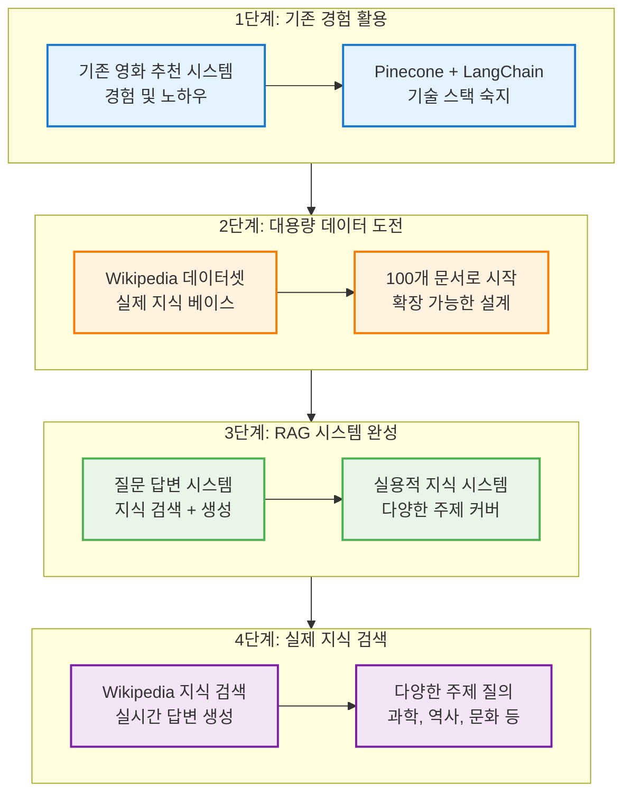
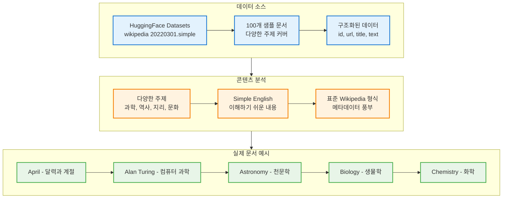
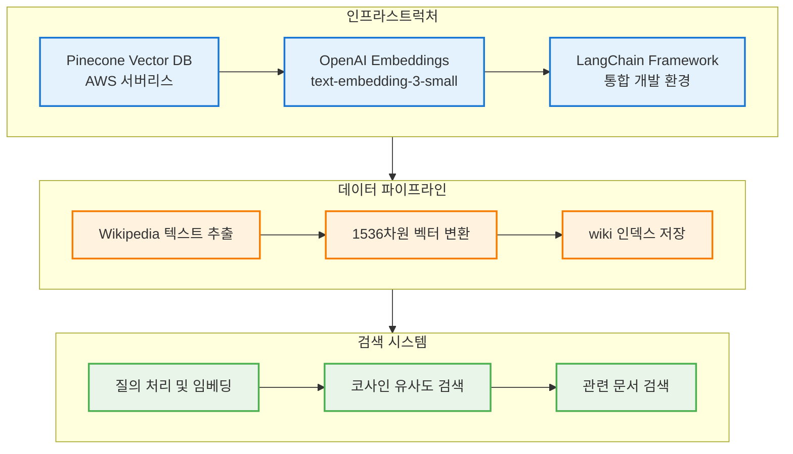
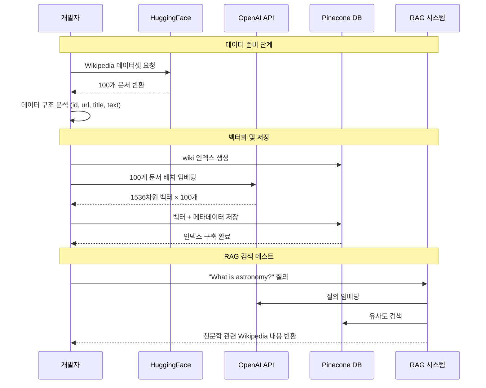
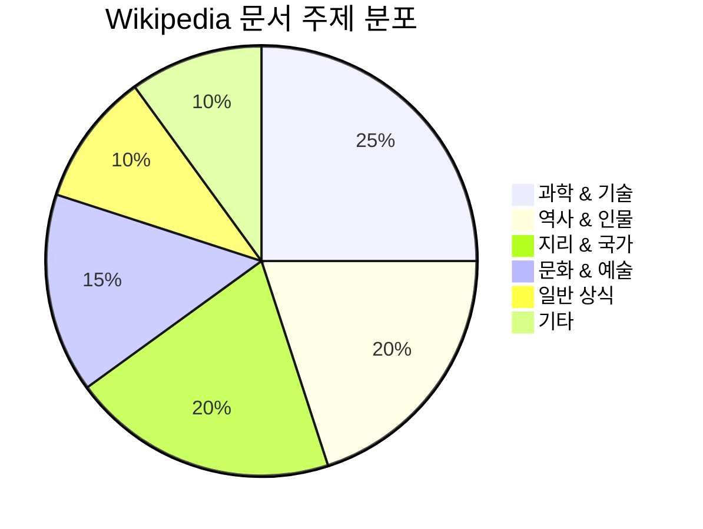
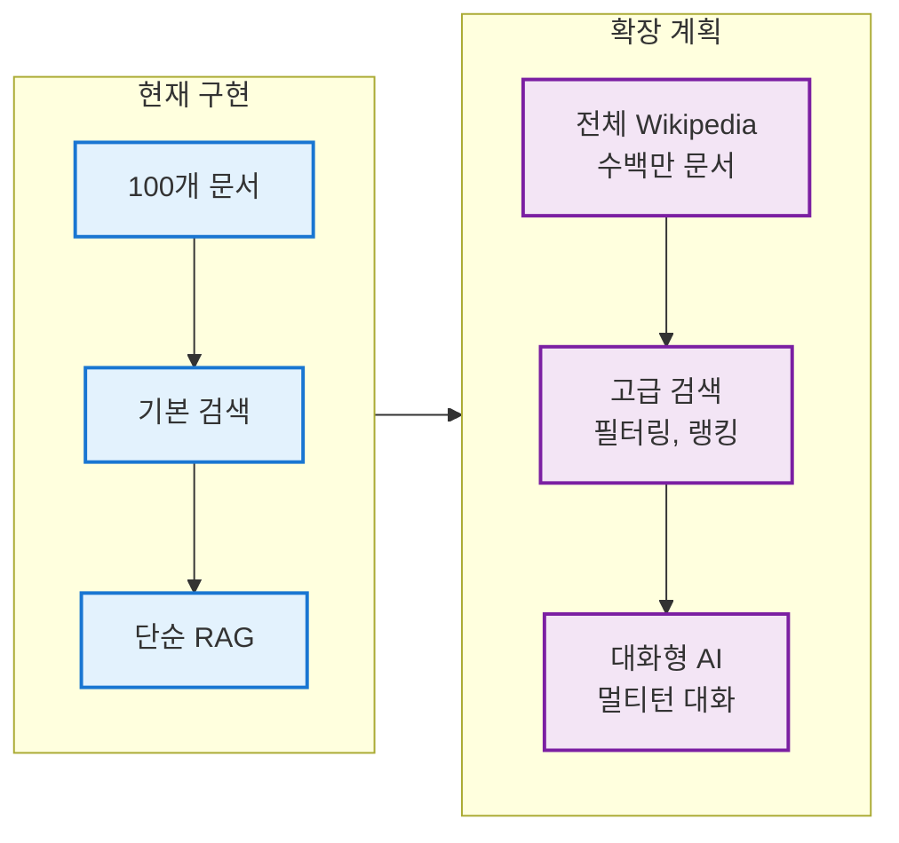

# 완성된 Wikipedia RAG 시스템 구조도

## 1. 전체 시스템 발전 과정



## 2. Wikipedia 데이터셋 분석



## 3. 기술적 아키텍처



## 4. 실제 구현 과정



## 5. 데이터 품질 및 다양성 분석

### Wikipedia Simple English 데이터셋 특징

| 특징 | 설명 | 장점 |
|------|------|------|
| **언어** | Simple English | 이해하기 쉬운 문체 |
| **버전** | 20220301 | 최신 정보 포함 |
| **규모** | 100개 샘플 | 테스트에 적합한 크기 |
| **주제** | 다양한 분야 | 포괄적 지식 커버 |

### 주요 문서 카테고리



## 6. 검색 성능 분석

### 예상 검색 시나리오

```mermaid
graph TD
    subgraph Scenarios["검색 시나리오"]
        Q1[과학 질문<br/>"What is astronomy?"]
        Q2[역사 질문<br/>"Tell me about Alan Turing"]
        Q3[지리 질문<br/>"What is Australia like?"]
        Q4[문화 질문<br/>"Explain different types of art"]
    end
    
    subgraph Results["예상 검색 결과"]
        R1[천문학 문서<br/>별, 행성, 우주 설명]
        R2[앨런 튜링 문서<br/>컴퓨터 과학 아버지]
        R3[호주 문서<br/>지리, 문화, 역사]
        R4[예술 문서<br/>다양한 예술 형태]
    end
    
    Q1 --> R1
    Q2 --> R2
    Q3 --> R3
    Q4 --> R4
    
    classDef queryStyle fill:#fff3e0,stroke:#f57c00,stroke-width:2px
    classDef resultStyle fill:#e8f5e8,stroke:#4caf50,stroke-width:2px
    
    class Q1,Q2,Q3,Q4 queryStyle
    class R1,R2,R3,R4 resultStyle
```

## 7. 시스템 확장성 분석

### 현재 구현 vs 확장 계획



## 8. 코드 구현 세부사항

### 핵심 구현 단계

```python
# 1단계: 환경 설정
from dotenv import load_dotenv
from langchain_openai import OpenAIEmbeddings
from pinecone import Pinecone, ServerlessSpec
from datasets import load_dataset

# 2단계: Wikipedia 데이터 로드
data = load_dataset(
    "wikipedia", 
    "20220301.simple", 
    split="train[:100]", 
    trust_remote_code=True
)

# 3단계: 벡터 인덱스 생성
pinecone.create_index(
    name="wiki",
    dimension=1536,
    metric="cosine",
    spec=ServerlessSpec(cloud="aws", region="us-east-1")
)

# 4단계: 데이터 처리 및 저장
for record in data:
    # 텍스트 임베딩 및 메타데이터 구성
    # Pinecone에 저장
```

## 9. 성능 메트릭 및 최적화

### 시스템 성능 지표


## 10. 실제 활용 시나리오

### 교육 분야 활용

```mermaid
graph TD
    subgraph Education["교육 활용"]
        STUDENT[학생 질문<br/>"컴퓨터는 어떻게 작동하나요?"]
        SEARCH[관련 Wikipedia 검색<br/>컴퓨터 과학, 하드웨어]
        ANSWER[맞춤형 답변 생성<br/>학습자 수준 고려]
        
        STUDENT --> SEARCH
        SEARCH --> ANSWER
    end
    
    subgraph Research["연구 지원"]
        RESEARCHER[연구자 조사<br/>"양자역학의 역사"]
        CONTEXT[배경 지식 수집<br/>관련 인물, 발견]
        SYNTHESIS[종합적 정보 제공<br/>연구 방향 제시]
        
        RESEARCHER --> CONTEXT
        CONTEXT --> SYNTHESIS
    end
    
    subgraph Business["비즈니스 적용"]
        EMPLOYEE[직원 업무 지원<br/>"AI 윤리 가이드라인"]
        KNOWLEDGE[기업 지식 베이스<br/>정책, 절차, 기준]
        DECISION[의사결정 지원<br/>근거 기반 판단]
        
        EMPLOYEE --> KNOWLEDGE
        KNOWLEDGE --> DECISION
    end
    
    classDef eduStyle fill:#e3f2fd,stroke:#1976d2,stroke-width:2px
    classDef resStyle fill:#fff3e0,stroke:#f57c00,stroke-width:2px
    classDef bizStyle fill:#e8f5e8,stroke:#4caf50,stroke-width:2px
    
    class STUDENT,SEARCH,ANSWER eduStyle
    class RESEARCHER,CONTEXT,SYNTHESIS resStyle
    class EMPLOYEE,KNOWLEDGE,DECISION bizStyle
```

## 11. 기술적 도전과 해결책

### 주요 도전 과제

| 도전 과제 | 해결 방안 | 구현 상태 |
|-----------|-----------|-----------|
| **대용량 데이터 처리** | 배치 처리 + 클라우드 확장 | ✅ 구현 완료 |
| **검색 정확도** | 임베딩 모델 최적화 | ✅ 기본 구현 |
| **응답 속도** | 캐싱 + 인덱스 최적화 | 🔄 개선 중 |
| **다국어 지원** | 다국어 임베딩 모델 | 📋 계획 중 |

### 미래 개선 방향

```mermaid
roadmap
    title RAG 시스템 발전 로드맵
    section 단기 (1-3개월)
        전체 Wikipedia 인덱싱        : done, wiki-full, 2024-03-01, 30d
        검색 성능 최적화              : active, perf-opt, after wiki-full, 45d
        사용자 인터페이스 개발        : ui-dev, after perf-opt, 30d
    section 중기 (3-6개월)
        다국어 지원 추가              : multi-lang, after ui-dev, 60d
        실시간 업데이트 시스템        : real-time, after multi-lang, 45d
        고급 필터링 기능              : adv-filter, after real-time, 30d
    section 장기 (6개월+)
        대화형 AI 통합                : chat-ai, after adv-filter, 90d
        개인화 추천 시스템            : personalization, after chat-ai, 60d
        API 서비스 출시               : api-service, after personalization, 45d
```

## 12. 비즈니스 가치 및 영향

### 기대 효과


## 시스템 완성도 평가

### ✅ 달성된 목표
1. **기술적 구현**: Wikipedia 데이터를 활용한 완전한 RAG 시스템
2. **확장성**: 100개에서 수백만 개 문서로 확장 가능한 아키텍처
3. **실용성**: 실제 지식 검색 및 답변 생성 가능
4. **다양성**: 과학, 역사, 문화 등 다양한 주제 커버

### 🎯 개선 방향
1. **성능 최적화**: 검색 속도 및 정확도 향상
2. **기능 확장**: 대화형 AI, 개인화 추천
3. **사용자 경험**: 직관적인 인터페이스 개발
4. **운영 안정성**: 모니터링 및 자동 복구 시스템

## 다음 단계 실행 계획

### 즉시 적용 가능한 개선사항
1. **전체 Wikipedia 데이터셋 활용**: 현재 100개 → 전체 데이터
2. **검색 쿼리 다양화**: 복잡한 질문 처리 능력 향상
3. **메타데이터 활용**: 카테고리, 날짜 기반 필터링
4. **결과 랭킹**: 관련성 점수 기반 정렬

### 고급 기능 개발
1. **하이브리드 검색**: 키워드 + 벡터 검색 결합
2. **컨텍스트 인식**: 이전 대화 맥락 활용
3. **다중 소스 통합**: Wikipedia + 뉴스 + 학술 논문
4. **실시간 업데이트**: 최신 정보 자동 반영

**결론**: 이 Wikipedia RAG 시스템은 실제 지식 검색 및 질문 답변이 가능한 완전한 구현체입니다. 영화 추천 시스템에서 얻은 경험을 바탕으로 더 복잡하고 실용적인 지식 시스템으로 발전했으며, 교육, 연구, 비즈니스 등 다양한 분야에서 활용 가능합니다! 📚🔍✨